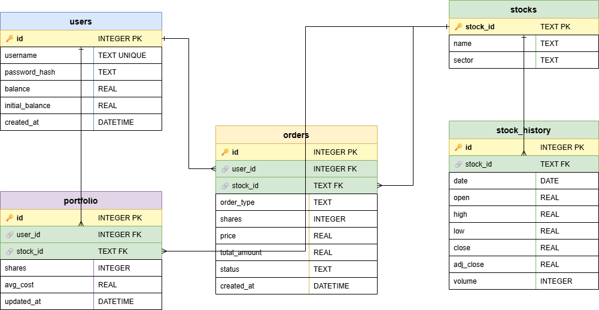

# 📈 台股模擬交易系統

> 資料庫期末專案 ── 以 FastAPI + SQLite + Ollama/Qwen 打造的台股模擬交易平台，支援帳號管理、歷史行情瀏覽、AI 局勢分析與買賣下單功能。

---

## 🗂️ 專案結構

```
114-2DATABASE_PROJECT/
├── backend/
│   └── database/
│       ├── init_db.py        # 建立 Schema、爬取 yfinance 歷史資料並寫入 SQLite
│       ├── database.py       # 資料庫連線與 CRUD 操作
│       ├── ai_service.py     # 組裝 Prompt 並呼叫 Ollama/Qwen
│       └── main.py           # FastAPI 主程式、API 路由定義
├── frontend/
│   ├── index.html            # 註冊 / 登入頁
│   └── dashboard.html        # 股票儀表板、K 線圖、AI 分析、下單介面
├── stock_market.db           # SQLite 資料庫（由 init_db.py 產生）
├── requirements.txt
└── README.md
```

---

## 🛠️ 技術棧

| 層級 | 技術 |
|------|------|
| 前端 | HTML / CSS / JavaScript、Chart.js |
| 後端 | Python 3.11、FastAPI、Uvicorn |
| 資料庫 | SQLite 3 |
| 歷史資料 | yfinance |
| AI 分析 | Ollama（本地）、Qwen2.5-7B-Instruct (INT4) |

---

## 🗄️ 資料庫設計

資料庫檔案為 `stock_market.db`，共包含 **5 張資料表**。以下為 Entity-Relationship 圖：



> 原始 draw.io 檔案位於 `graph/schema.drawio`，可用 [draw.io](https://app.diagrams.net/) 或 VSCode Draw.io Integration 擴充套件開啟編輯。

**圖例說明：**
- 🔑 黃色列 ── Primary Key
- 🔗 綠色列 ── Foreign Key
- `1` / `N` ── 一對多關聯

---

## 📋 資料表說明

### 1. `users` ── 使用者帳號

存放所有註冊使用者的帳號資訊與資產狀態。

| 欄位 | 型別 | 說明 |
|------|------|------|
| `id` | INTEGER PK | 流水號，自動遞增 |
| `username` | TEXT UNIQUE | 登入帳號（不可重複） |
| `password_hash` | TEXT | bcrypt 雜湊密碼（明碼絕不儲存） |
| `balance` | REAL | 目前可用餘額（NTD） |
| `initial_balance` | REAL | 初始資金；與 `balance` 相減可算出總損益 |
| `created_at` | DATETIME | 帳號建立時間 |

**範例資料：**
```
id │ username │ balance   │ initial_balance │ created_at
───┼──────────┼───────────┼─────────────────┼────────────────────
1  │ alice    │ 850,000   │ 1,000,000       │ 2024-12-25 09:00:00
2  │ bob      │ 1,230,000 │ 1,000,000       │ 2024-12-26 10:15:00
```

---

### 2. `stocks` ── 股票基本資訊

靜態資料表，記錄系統支援的 **30 檔台股**，在 `init_db.py` 初始化時一次寫入。

| 欄位 | 型別 | 說明 |
|------|------|------|
| `stock_id` | TEXT PK | 股票代碼（如 `2330`，不含 `.TW`） |
| `name` | TEXT | 中文名稱 |
| `sector` | TEXT | 產業別 |

**涵蓋產業：** 半導體、電子代工、消費電子、工業自動化、金融、電信、石化傳產、航運

**範例資料：**
```
stock_id │ name     │ sector
─────────┼──────────┼────────────
2330     │ 台積電   │ 半導體
2603     │ 長榮     │ 航運
2412     │ 中華電   │ 電信
2881     │ 富邦金   │ 金融
6669     │ 緯穎     │ 工業自動化
```

---

### 3. `stock_history` ── 歷史行情（最大表）

由 `yfinance` 批次下載 2023-01-01 ～ 2025-01-01 的日線 OHLCV 資料，**約 18,000 筆**（30 檔 × 約 500 個交易日）。

| 欄位 | 型別 | 說明 |
|------|------|------|
| `id` | INTEGER PK | 自動遞增 |
| `stock_id` | TEXT FK | 對應 `stocks.stock_id` |
| `date` | DATE | 交易日（格式：`YYYY-MM-DD`） |
| `open` | REAL | 開盤價 |
| `high` | REAL | 最高價 |
| `low` | REAL | 最低價 |
| `close` | REAL | 收盤價（除權息調整後） |
| `adj_close` | REAL | 調整後收盤價（同 `close`，`auto_adjust=True`）|
| `volume` | INTEGER | 成交量（股） |

> `UNIQUE(stock_id, date)` 防止重複寫入；使用 `INSERT OR IGNORE` 可安全重複執行。

**範例資料（台積電近 3 日）：**
```
id │ stock_id │ date       │ open  │ high  │ low   │ close │ volume
───┼──────────┼────────────┼───────┼───────┼───────┼───────┼────────
1  │ 2330     │ 2024-12-25 │ 581.6 │ 581.9 │ 573.2 │ 575.1 │ 18,434
2  │ 2330     │ 2024-12-26 │ 577.1 │ 587.4 │ 566.6 │ 575.4 │  8,905
3  │ 2330     │ 2024-12-27 │ 570.7 │ 573.4 │ 566.2 │ 570.2 │ 76,426
```

---

### 4. `orders` ── 交易紀錄

每筆買入／賣出操作均新增一筆記錄，不修改、不刪除（Append-only）。

| 欄位 | 型別 | 說明 |
|------|------|------|
| `id` | INTEGER PK | 自動遞增 |
| `user_id` | INTEGER FK | 對應 `users.id` |
| `stock_id` | TEXT FK | 對應 `stocks.stock_id` |
| `order_type` | TEXT | `'buy'` 或 `'sell'` |
| `shares` | INTEGER | 股數（須 > 0） |
| `price` | REAL | 成交價格 |
| `total_amount` | REAL | 成交總金額（= shares × price） |
| `status` | TEXT | 訂單狀態，預設 `'completed'` |
| `created_at` | DATETIME | 下單時間 |

> 下單使用 **Transaction**：同時更新 `users.balance` 與插入 `orders`，任一失敗則全部 rollback，確保資料一致性。

**範例資料：**
```
id │ user_id │ stock_id │ order_type │ shares │ price  │ total_amount │ status
───┼─────────┼──────────┼────────────┼────────┼────────┼──────────────┼──────────
1  │ 1       │ 2330     │ buy        │ 1,000  │ 580.0  │ 580,000      │ completed
2  │ 1       │ 2603     │ buy        │ 2,000  │ 185.0  │ 370,000      │ completed
3  │ 1       │ 2603     │ sell       │ 1,000  │ 210.5  │ 210,500      │ completed
```

---

### 5. `portfolio` ── 目前持倉

即時記錄每位使用者的持股狀態，買入時 upsert、賣出時更新股數。

| 欄位 | 型別 | 說明 |
|------|------|------|
| `id` | INTEGER PK | 自動遞增 |
| `user_id` | INTEGER FK | 對應 `users.id` |
| `stock_id` | TEXT FK | 對應 `stocks.stock_id` |
| `shares` | INTEGER | 目前持有股數 |
| `avg_cost` | REAL | 平均成本（加權平均買入價） |
| `updated_at` | DATETIME | 最後更新時間 |

> `UNIQUE(user_id, stock_id)` 確保每人每檔股票只有一筆持倉記錄。

**平均成本計算公式：**
```
新均價 = (舊均價 × 舊股數 + 買入價 × 買入股數) / (舊股數 + 買入股數)
```

**範例資料：**
```
id │ user_id │ stock_id │ shares │ avg_cost │ 未實現損益（試算）
───┼─────────┼──────────┼────────┼──────────┼───────────────────
1  │ 1       │ 2330     │ 1,000  │ 580.0    │ (575.1-580)×1000 = -4,900
2  │ 1       │ 2603     │ 1,000  │ 185.0    │ (186.2-185)×1000 = +1,200
3  │ 2       │ 2881     │ 5,000  │ 68.5     │ (68.7-68.5)×5000 = +1,000
```

---

## 🚀 快速開始

### 1. 安裝相依套件

```bash
pip install -r requirements.txt
```

`requirements.txt` 內容：
```
fastapi
uvicorn
yfinance
pandas
bcrypt
requests
```

### 2. 初始化資料庫

```bash
cd backend/database
python init_db.py
```

執行後會產生 `stock_market.db`，可用 VSCode SQLite Viewer 擴充套件開啟檢視。

### 3. 啟動後端 API

```bash
uvicorn main:app --reload --port 8000
```

### 4. 開啟前端

直接用瀏覽器開啟 `frontend/index.html`，或透過 VSCode Live Server（port 5500）。

> ⚠️ 前端若出現 CORS 錯誤，請確認 `main.py` 已加入 `CORSMiddleware`。

---

## 🔗 核心 API 端點

| 方法 | 路徑 | 功能 |
|------|------|------|
| POST | `/api/register` | 註冊新帳號 |
| POST | `/api/login` | 登入取得使用者資訊 |
| GET | `/api/stocks` | 取得 30 檔股票清單 |
| GET | `/api/stock/{stock_id}` | 取得特定股票近 30 天歷史資料 |
| POST | `/api/analyze` | 呼叫 Ollama/Qwen 進行 AI 局勢分析 |
| POST | `/api/trade` | 買入／賣出股票（含 Transaction） |
| GET | `/api/portfolio/{user_id}` | 取得使用者目前持倉 |

---

## 📌 注意事項

- `password_hash` 使用 **bcrypt** 雜湊，請勿儲存或傳輸明碼
- AI 分析功能需本地執行 Ollama 並載入 `qwen2.5:7b` 模型
- SQLite 並發寫入限制：建立連線時請加 `check_same_thread=False`
- `stock_history` 使用 `INSERT OR IGNORE` 可安全重複執行 `init_db.py`